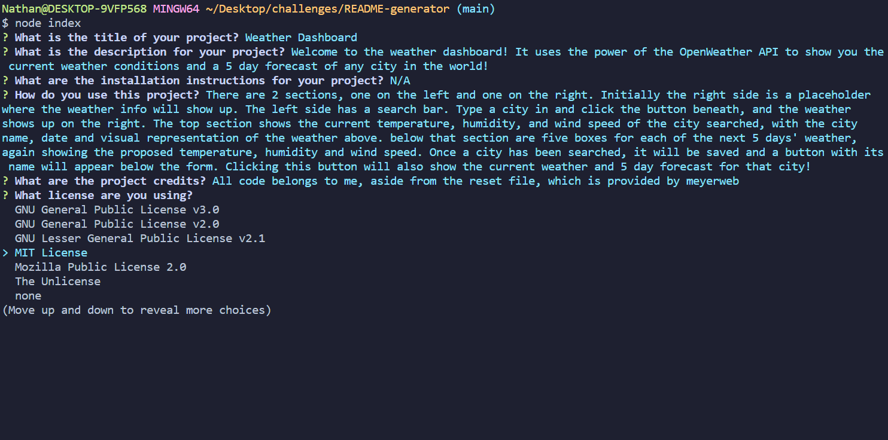

## README Generator

# Description

This is a README generator, powered by node.js and inquirer. When the user runs the index file, they will answer a series of prompts. Based on those answers a README file will be created that the user can use for their project.

# Usage

The user will run the index file on their command line of choice. They will be asked several questions: what the title of the project is, a description for it, how to install the project, how to use the project, credits to others involved. After being queried for the credits section, they will be given a list of licenses to choose from. They can choose one of those, or to not include one. If they don't include one, those features will not appear on the README. After that are questions for features of the project, how to contribute to the project, and test for the project. Finally, they will be queried for their github username and email, which will be included in a questions section, along with the repo of the project. Once they have answered all the questions, the README is created and available for use. 

# Link

This video will show how the program is used:

# Credits

Thanks to github for showing all the common licenses and their badges!